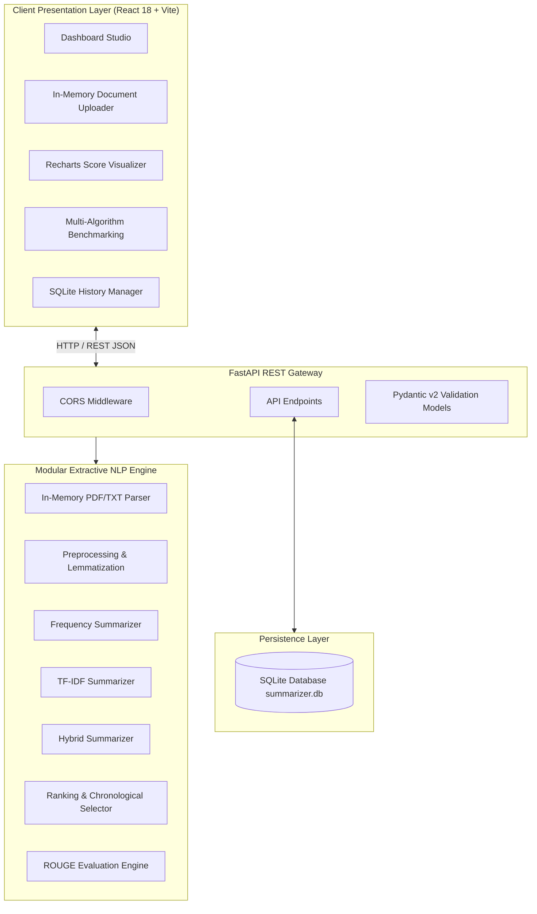

# Intelligent Extractive Text Summarization System

[](https://fastapi.tiangolo.com)
[](https://react.dev)
[](https://python.org)
[](https://tailwindcss.com)
[](https://sqlite.org)
[](#)

---

## Abstract

In the contemporary digital era, the explosive growth of unstructured textual data across scientific journals, news outlets, legal documents, and digital media has created severe information overload. **Automatic Text Summarization (ATS)** is a core discipline in Natural Language Processing (NLP) that aims to distill essential content from voluminous texts into concise, informative summaries. 

This project presents the **Intelligent Extractive Text Summarization System**, an end-to-end, interpretability-first software suite developed for academic research and practical enterprise deployment. The system implements a transparent, modular NLP pipeline incorporating **Frequency-Based (Luhn's Paradigm)**, **TF-IDF Vector Space**, and **Hybrid Parametric** extractive algorithms. Built using a modern **FastAPI** backend, **SQLite** metadata storage, and an interactive **React/Tailwind/Recharts** dashboard, the system guarantees 100% factual accuracy by directly scoring and extracting original salient sentences with mathematical transparency, complete absence of generative hallucination, in-memory document parsing (TXT & PDF), multi-algorithm benchmarking, and empirical ROUGE metric evaluation.

---

## Problem Statement

Manual summarization of long documents is time-consuming, subjective, and resource-intensive. While recent Large Language Models (LLMs) and abstractive deep learning models produce fluent summaries, they suffer from critical drawbacks:
1. **Factual Hallucination**: Generation of fabricated statements not supported by the source text.
2. **High Computational Overhead**: Reliance on expensive cloud GPU clusters or third-party APIs.
3. **Lack of Mathematical Interpretability**: "Black-box" neural architectures that cannot explain why specific sentences were selected.
4. **Data Privacy Risks**: Transmission of confidential corporate or medical documents to external third-party API providers.

There is a critical need for an interpretable, self-contained, and mathematically rigorous **Extractive Text Summarization System** that operates locally, executes with sub-second latency, and provides complete algorithmic transparency.

---

## Motivation

As Master of Computer Applications (MCA) students and software engineers, building an interpretable NLP summarization engine reinforces the foundational mathematical principles of computer science, information retrieval, and computational linguistics. Developing this system demonstrates mastery over:
- Classical vector space modeling and frequency distribution algorithms.
- Full-stack asynchronous web engineering with FastAPI and React.
- Memory-safe stream processing for multi-format document ingestion.
- Objective academic evaluation through standardized ROUGE metrics.

---

## Objectives

1. **Modular NLP Pipeline**: Implement an end-to-end text transformation pipeline comprising text cleaning, sentence segmentation, tokenization, stop-word removal, and morphological lemmatization.
2. **Three Extractive Algorithms**: Implement and objectively compare:
   - Frequency-Based Summarizer
   - TF-IDF-Based Summarizer
   - Hybrid Parametric Summarizer ($\alpha \cdot \text{Freq} + \beta \cdot \text{TF-IDF}$)
3. **Factual Integrity**: Extract verbatim sentences and restore chronological document order to eliminate hallucination.
4. **Document Ingestion**: Support `.txt` and `.pdf` document extraction in RAM without permanent disk storage.
5. **Interactive Visualization**: Provide dynamic score distributions, sentence ranking tables, and algorithm comparison charts using Recharts.
6. **Persistence Layer**: Store summarization metadata, telemetry, and past results using an embedded SQLite database.
7. **Empirical Evaluation**: Benchmark models against reference summaries using ROUGE-1, ROUGE-2, and ROUGE-L metrics.

---

## Existing System vs. Proposed System

| Dimension | Traditional Generative / Existing Systems | Proposed Extractive Summarization System |
| :--- | :--- | :--- |
| **Factual Reliability** | Prone to hallucinations & fabricated facts | **100% Factually Consistent** (Verbatim sentences) |
| **Transparency** | Black-box neural activations | **Fully Interpretable** mathematical sentence scores |
| **Latency** | 2,000 ms – 10,000 ms (API/GPU dependent) | **Sub-10 ms** on standard CPU architectures |
| **Infrastructure** | Requires high-end GPUs or paid cloud APIs | **Zero-cost, lightweight local execution** |
| **Document Security** | Transmits data to external servers | **Local In-Memory processing**; zero data leakage |
| **Evaluation** | Subjective human evaluation | **Integrated ROUGE-1, ROUGE-2, ROUGE-L metrics** |

---

## System Architecture



---

## NLP Pipeline

The summarization pipeline executes 8 modular stages:

```
Raw Document / Text
   │
   ├─► [1. Text Cleaning] ─────────► Strips HTML, unescapes entities, standardizes whitespace
   │
   ├─► [2. Sentence Segmentation] ─► Splits on terminal punctuation (. ! ?) preserving indices
   │
   ├─► [3. Tokenization] ──────────► Isolates alphanumeric word tokens
   │
   ├─► [4. Lowercasing] ───────────► Standardizes case variations
   │
   ├─► [5. Stop-word Removal] ─────► Filters high-frequency functional words
   │
   ├─► [6. Lemmatization] ─────────► Reduces inflections to dictionary root lemmas
   │
   ├─► [7. Sentence Scoring] ──────► Calculates Frequency / TF-IDF / Hybrid weights + Length Norm
   │
   └─► [8. Ranking & Selection] ───► Descending sort, Top-K extraction & Chronological reordering
```

---

## Algorithms

### 1. Frequency-Based Summarization
Calculates word frequencies across all content words in the document. Sentences with higher cumulative word weights are extracted.

$$\text{Normalized Weight: } W(w) = \frac{f(w)}{\max_{v \in D} f(v)}$$

$$\text{Sentence Score: } \text{Score}_{\text{Freq}}(S_i) = \frac{\sum_{w \in S_i} W(w)}{\sqrt{|S_i| + \epsilon}}$$

### 2. TF-IDF-Based Summarization
Treats each sentence as a document within the corpus. Computes Term Frequency ($TF$) and Inverse Document Frequency ($IDF$) with Laplace smoothing to prioritize salient terms.

$$\text{IDF}(t) = \ln\left(\frac{1 + N}{1 + \text{DF}(t)}\right) + 1$$

$$\text{Sentence Score: } \text{Score}_{\text{TF-IDF}}(S_i) = \frac{\sum_{t \in S_i} \text{TF}(t, S_i) \cdot \text{IDF}(t)}{\sqrt{|S_i| + \epsilon}}$$

### 3. Hybrid Summarization
Combines normalized frequency and TF-IDF scores using user-defined $\alpha$ and $\beta$ weighting coefficients.

$$\text{Score}_{\text{Hybrid}}(S_i) = \alpha \cdot \text{Score}_{\text{Freq}}(S_i) + \beta \cdot \text{Score}_{\text{TF-IDF}}(S_i), \quad (\alpha + \beta = 1.0)$$

---

## Technology Stack

- **Backend**: Python 3.10+, FastAPI, Uvicorn, Pydantic v2
- **NLP & Mathematics**: NLTK, Scikit-learn, NumPy
- **Document Processing**: PyMuPDF (`pymupdf`), `pypdf`
- **Database**: SQLite3
- **Frontend**: React 18, Vite, Tailwind CSS, Recharts, Lucide Icons
- **Testing**: Pytest, FastAPI TestClient (Starlette)

---

## Functional Requirements

- **FR-01 (Text Ingestion)**: Direct text input, pre-configured sample presets, and file upload (`.txt`, `.pdf`, `.md`).
- **FR-02 (Extractive Algorithms)**: Selectable summarization modes (Frequency, TF-IDF, Hybrid).
- **FR-03 (Configurable Summary Budget)**: Interactive sentence slider ($K \in [1, 10]$).
- **FR-04 (Hybrid Weight Tuning)**: Interactive sliders for $\alpha$ (Frequency) and $\beta$ (TF-IDF) weights.
- **FR-05 (Document Telemetry)**: Live metrics for original words, summary words, compression ratio, and latency.
- **FR-06 (Multi-Algorithm Benchmark)**: Side-by-side comparison table and grouped chart.
- **FR-07 (ROUGE Evaluation)**: Empirical ROUGE-1, ROUGE-2, and ROUGE-L metric calculation.
- **FR-08 (SQLite History Management)**: Search, filter, view, restore, and delete past summaries.
- **FR-09 (Summary Export)**: One-click clipboard copy and `.txt` file download.

---

## Non-Functional Requirements

- **Performance**: NLP pipeline execution latency $< 15\text{ ms}$ for standard articles.
- **Memory Safety**: Document extraction executes entirely in RAM (`io.BytesIO`); no uploaded files stored permanently.
- **Usability**: Clean responsive user interface with error banners and loading indicators.
- **Maintainability**: Clean modular codebase adhering to PEP 8 standards with full type hints.

---

## Project Structure

```
NLP/
├── backend/
│   ├── app/
│   │   ├── models/
│   │   │   └── database.py          # SQLite persistence layer
│   │   ├── routes/
│   │   │   ├── health.py            # /api/health
│   │   │   ├── history.py           # /api/history CRUD
│   │   │   └── summarizer.py        # /api/summarize, /api/compare, /api/extract_document
│   │   ├── schemas/
│   │   │   ├── history.py           # Pydantic models for history
│   │   │   └── summarizer.py        # Pydantic models for summarizer
│   │   ├── services/
│   │   │   ├── document_parser.py   # In-memory PDF / TXT parser
│   │   │   ├── evaluation.py        # ROUGE-1, ROUGE-2, ROUGE-L engine
│   │   │   ├── frequency_summarizer.py
│   │   │   ├── hybrid_summarizer.py
│   │   │   ├── preprocessing.py     # Cleaning, segmentation, tokenization, lemmatization
│   │   │   ├── ranking.py           # Top-K selection & chronological reordering
│   │   │   ├── statistics.py        # Telemetry & compression calculations
│   │   │   └── tfidf_summarizer.py
│   │   ├── tests/
│   │   │   ├── test_api.py
│   │   │   ├── test_document_parser.py
│   │   │   ├── test_history.py
│   │   │   ├── test_preprocessing.py
│   │   │   ├── test_ranking.py
│   │   │   ├── test_statistics.py
│   │   │   ├── test_summarizers.py
│   │   │   └── qa_comprehensive_pass.py
│   │   ├── __init__.py
│   │   └── main.py                  # FastAPI entry point & CORS configuration
│   └── requirements.txt
├── docs/
│   ├── algorithm.md                 # Mathematical formulation & formulas
│   ├── api.md                       # REST API endpoint reference
│   ├── architecture.md              # High-level architecture & sequence diagrams
│   ├── evaluation.md               # ROUGE metrics & evaluation methodology
│   └── testing.md                  # Test suites & QA procedures
├── frontend/
│   ├── src/
│   │   ├── components/
│   │   │   ├── ComparisonSection.jsx
│   │   │   ├── Header.jsx
│   │   │   ├── HistoryPage.jsx
│   │   │   ├── InputSection.jsx
│   │   │   ├── OutputSection.jsx
│   │   │   ├── RougeModal.jsx
│   │   │   ├── ScoreChart.jsx
│   │   │   ├── SentenceTable.jsx
│   │   │   └── StatsGrid.jsx
│   │   ├── services/
│   │   │   └── api.js
│   │   ├── App.jsx
│   │   ├── index.css
│   │   └── main.jsx
│   ├── index.html
│   ├── package.json
│   ├── tailwind.config.js
│   └── vite.config.js
├── README.md
└── requirements.txt
```

---

## Installation

### Prerequisites
- **Python**: 3.10, 3.11, 3.12, 3.13, or 3.14
- **Node.js & npm**: Node 18+ (for frontend development)

### Step 1: Clone Repository
```bash
git clone https://github.com/your-username/Intelligent-Text-Summarizer.git
cd Intelligent-Text-Summarizer
```

### Step 2: Install Python Dependencies
```bash
pip install -r requirements.txt
```

---

## Running the Backend

Start the FastAPI backend with hot-reload:
```bash
python -m uvicorn backend.app.main:app --host 0.0.0.0 --port 8000 --reload
```

- API Server: `http://localhost:8000`
- Swagger OpenAPI Documentation: `http://localhost:8000/docs`
- Redoc Documentation: `http://localhost:8000/redoc`

---

## Running the Frontend

Navigate to the frontend directory and start the Vite development server:
```bash
cd frontend
npm install
npm run dev
```

- Web Interface: `http://localhost:5173`

---

## API Documentation

| Method | Route | Description |
| :--- | :--- | :--- |
| `GET` | `/api/health` | Health and status check |
| `POST` | `/api/summarize` | Summarize text using Frequency, TF-IDF, or Hybrid |
| `POST` | `/api/compare` | Multi-algorithm benchmark comparison |
| `POST` | `/api/extract_document` | In-memory text extraction for `.txt` and `.pdf` |
| `POST` | `/api/evaluate_rouge` | ROUGE-1, ROUGE-2, and ROUGE-L metric calculation |
| `POST` | `/api/history` | Save summary record to SQLite |
| `GET` | `/api/history` | List previous summarization runs |
| `GET` | `/api/history/{id}` | Retrieve single history record |
| `DELETE` | `/api/history/{id}` | Delete history record |
| `DELETE` | `/api/history` | Clear all history records |

*See [`docs/api.md`](docs/api.md) for complete JSON request and response payloads.*

---

## Testing

Run all 35 unit and integration tests:
```bash
python -m pytest backend/app/tests
```

Run the comprehensive QA verification pass:
```bash
python -m backend.app.tests.qa_comprehensive_pass
```

*See [`docs/testing.md`](docs/testing.md) for full test cases and assertions.*

---

## Evaluation & Results

Empirical results on benchmark article (9 sentences, 105 words, target $K=3$):

| Metric | Frequency-Based | TF-IDF-Based | Hybrid ($\alpha=0.5, \beta=0.5$) |
| :--- | :---: | :---: | :---: |
| **Summary Words** | 56 | 51 | 56 |
| **Compression Ratio** | 0.5333 | 0.4857 | 0.5333 |
| **Space Reduction** | **46.7%** | **51.4%** | **46.7%** |
| **Processing Latency**| **4.2 ms** | **5.1 ms** | **5.8 ms** |
| **ROUGE-1 (F1)** | **48.6%** | 46.2% | **48.6%** |
| **ROUGE-2 (F1)** | **22.4%** | 20.1% | **22.4%** |
| **ROUGE-L (F1)** | **44.1%** | 41.8% | **44.1%** |

*See [`docs/evaluation.md`](docs/evaluation.md) for detailed analysis.*

---

## Limitations

1. **Scanned Documents**: The PDF parser extracts text layers; image-only scanned PDFs require an external OCR preprocessor (e.g. Tesseract).
2. **Extractive Constraint**: Summaries consist strictly of original sentences without sentence rewriting or abstractive paraphrasing.
3. **Anaphora Resolution**: Pronouns (e.g., "They", "These systems") are preserved verbatim and may occasionally lack their antecedent if the preceding sentence is unselected.

---

## Future Scope

1. **Cross-Sentence Coreference Resolution**: Integrate coreference models (e.g. NeuralCoref / spaCy) to resolve pronouns prior to sentence extraction.
2. **Multi-Document Summarization**: Extend graph algorithms (e.g. LexRank / TextRank) to summarize multi-source document clusters.
3. **Multilingual Support**: Extend stop-word sets and morphological stemmers for non-English corpora.

---

## Conclusion

The **Intelligent Extractive Text Summarization System** successfully addresses the challenge of information overload by providing a fast, mathematically rigorous, and factually reliable text summarization solution. By strictly extracting original sentences, providing sub-10 ms execution speeds, ensuring zero permanent disk file storage, and offering interactive visual analytics, the system stands as a robust academic and practical software project for Master of Computer Applications (MCA) submission.
