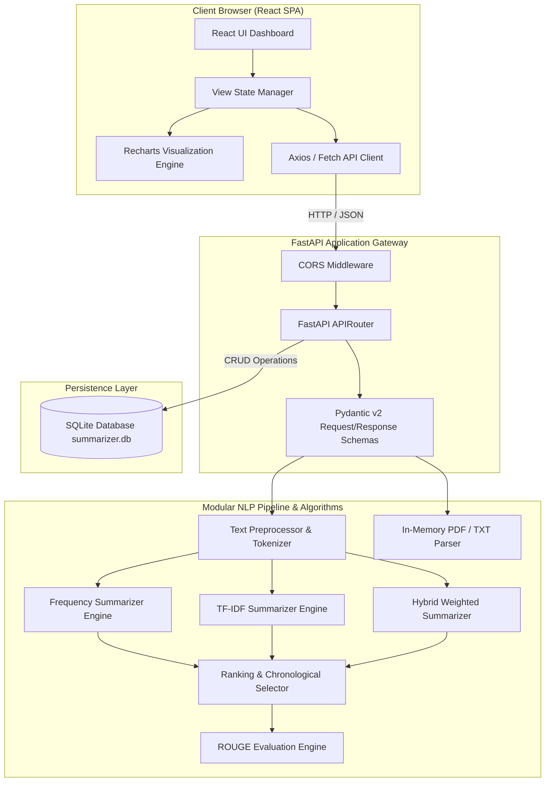
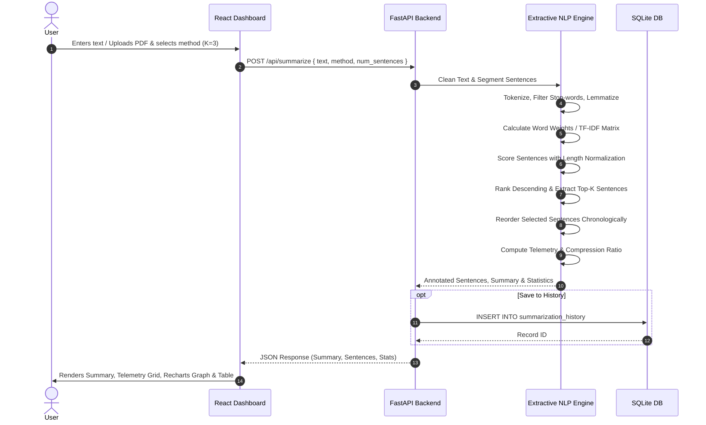

# System Architecture Documentation

## Intelligent Extractive Text Summarization System

---

### 1. High-Level Architectural Overview

The **Intelligent Extractive Text Summarization System** follows a decoupled, three-tier micro-architecture designed for performance, modularity, and interpretability:

1. **Presentation Layer (Frontend)**: React 18 SPA bundled with Vite, styled with Tailwind CSS, utilizing Recharts for data visualization.
2. **Application & API Layer (Backend)**: FastAPI (Python 3.10+) providing asynchronous RESTful endpoints with automated OpenAPI (Swagger) generation and strict Pydantic v2 data validation schemas.
3. **Core Engine Layer (NLP & Analytics)**: Modular Natural Language Processing engines implementing Frequency, TF-IDF, and Hybrid mathematical sentence scoring models.
4. **Persistence Layer (Data Storage)**: Embedded SQLite database (`summarizer.db`) for storing summarization metadata, telemetry metrics, and past runs with zero external database dependencies.

---

### 2. Detailed Component Breakdown

#### A. Document Parser (`backend/app/services/document_parser.py`)
- **Memory-Safe File Ingestion**: Ingests `.txt`, `.md`, and `.pdf` documents via in-memory stream buffers (`io.BytesIO`).
- **Zero Permanent Disk Storage**: Raw binary files are discarded from memory immediately after extraction, preventing disk bloat and safeguarding sensitive documents.
- **Dual-Engine PDF Extraction**: Primary extraction via PyMuPDF (`pymupdf`) with fallback to `pypdf`.

#### B. Preprocessing Engine (`backend/app/services/preprocessing.py`)
- **Cleaning & Normalization**: HTML unescaping, tag stripping, whitespace standardization.
- **Sentence Segmentation**: Boundary detection preserving sentence-ending punctuation.
- **Tokenization & Lemmatization**: Regex-based tokenization, English stop-word removal, and morphological reduction using WordNet with fallback affix rules.

#### C. Extractive Algorithms (`backend/app/services/`)
- **Frequency Summarizer** (`frequency_summarizer.py`): Word frequency normalization and square-root sentence length normalization.
- **TF-IDF Summarizer** (`tfidf_summarizer.py`): Vector Space sentence representation using scikit-learn's `TfidfVectorizer` with Laplace smoothing.
- **Hybrid Summarizer** (`hybrid_summarizer.py`): Parameterized linear combination of word frequency and TF-IDF vectors ($\alpha \cdot \text{Freq} + \beta \cdot \text{TF-IDF}$).

#### D. Ranking & Chronological Selection (`backend/app/services/ranking.py`)
- **Descending Score Sorting**: Assigns integer ranks ($1 \dots N$).
- **Top-$K$ Budgeting**: Selects the top $K$ highest-scoring sentences.
- **Order Restoration**: Restores selected sentences back to their original document sequence ($S_1, S_2 \dots$) to preserve factual flow and narrative cohesion.

#### E. Persistence Layer (`backend/app/models/database.py`)
- Embedded SQLite database maintaining execution metadata, word counts, compression ratios, and timestamps.

---

### 3. Data Flow Diagram

---

### 4. Security & Error Handling

- **Strict Input Validation**: Pydantic models validate data types, minimum text lengths, and parameter ranges before reaching the NLP core.
- **CORS Middleware**: Explicit CORS headers allow secure integration between frontend and backend ports.
- **Graceful Error Handling**: Descriptive HTTP error responses (`400 Bad Request`, `413 Payload Too Large`, `422 Unprocessable Content`, `500 Internal Error`) with custom error messages.
